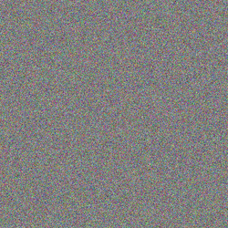

Active research --> looking for friends!

# Purpose of Project

[slides](https://maciejczyzewski.github.io/fast_gpu_voronoi/slides.pdf)

| Our method                     | Current best          |
|--------------------------------|-----------------------|
| JFA\*                          | JFA                   |
|  |   |
| steps = log*(2000) = 4         | steps = log(720) ~= 10|

for x = 720; y = 720; seeds = 2000 (read as n = 2000; p = 720).

# Implemented Algorithms

|                      | JFA$\star$      | JFA$+$          | JFA             |
|----------------------|-----------------|-----------------|-----------------|
| used improvement     | noise+selection | noise           | --              |
| num. of needed steps | log$\star$(n)   | log4(p)         | log2(p)         |
| step size            | $\frac{p}{3^i}$ | $\frac{p}{2^i}$ | $\frac{p}{2^i}$ |

# Research Papers

- ``Jump Flooding in GPU with Applications to Voronoi Diagram and Distance
	Transform'', Guodong Rong, Tiow-Seng Tan, 2006
- ``Facet-JFA: Faster computation of discrete Voronoi diagrams'', Talha Bin
	Masoodi, Hari Krishna Malladi, Vijay Natarajan, 2014

# Installation & Example

```
$ pip3 install fast_gpu_voronoi
```

```python3
from fast_gpu_voronoi       import Instance
from fast_gpu_voronoi.jfa   import JFA_star
from fast_gpu_voronoi.debug import save

I = Instance(alg=JFA_star, x=50, y=50, \
        pts=[[ 7,14], [33,34], [27,10],
             [35,10], [23,42], [34,39]])
I.run()

print(I.M.shape)                 # (50, 50, 1)
save(I.M, I.x, I.y, force=True)  # __1_debug.png
```

# Development

```bash
$ git clone git@github.com:maciejczyzewski/fast_gpu_voronoi.git
$ pip3 install -r requirements.txt
$ pytest
```

# Thanks


